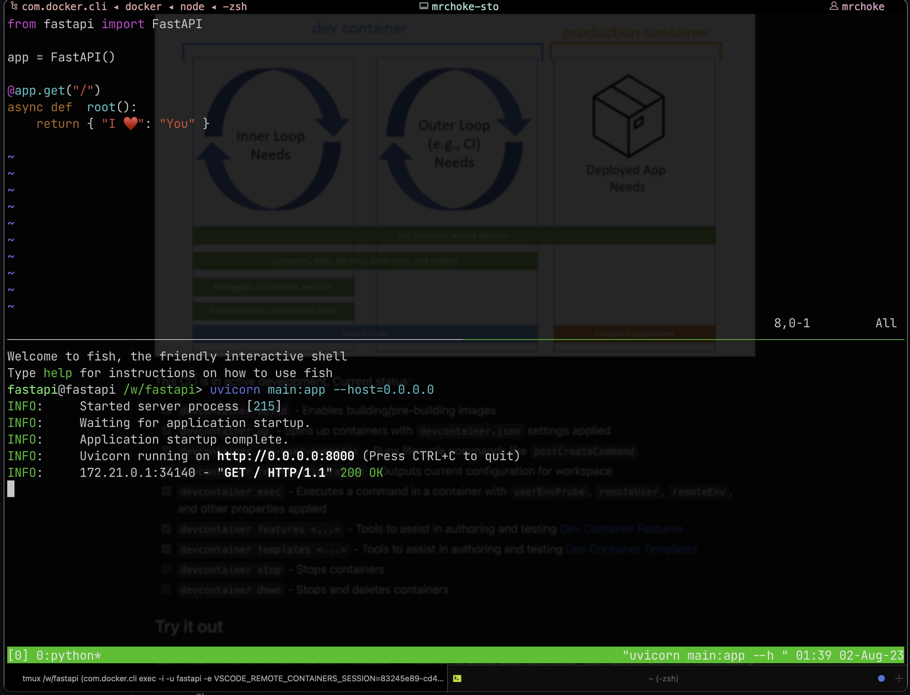
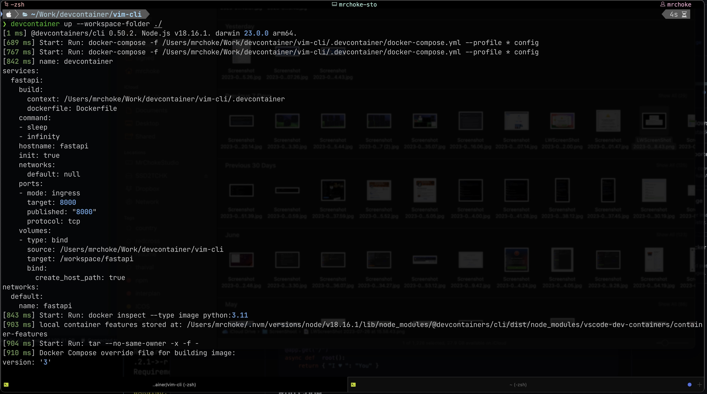
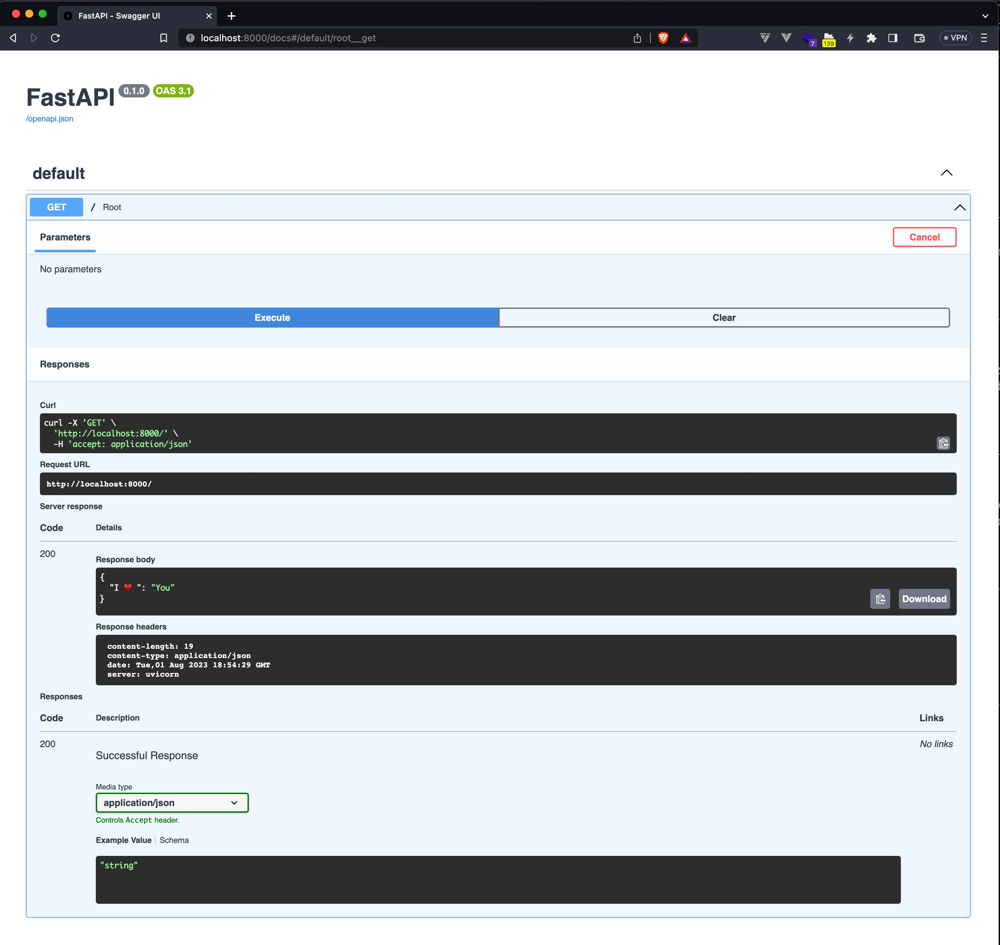

# DevContainer From Scratch



## Requirement for this project

- docker
- docker-compose

## Install Devcontainer CLI

```bash
npm install -g @devcontainers/cli
```

## Clone

```bash
git clone https://github.com/mrchoke/devcontainer-from-scratch.git
```

## Run

```bash
cd devcontainer-from-scratch
devcontainer up --workspace-folder ./
devcontainer exec --workspace-folder ./ fish
```



## Dev

```bash
vim main.py
```

`main.py`

```python
from fastapi import FastAPI

app = FastAPI()

@app.get("/")
async def  root():
    return { "I ♥️ ": "You" }
```

## Run Code

```bash
uvicorn main:app --host=0.0.0.0
```

## Open API

```
curl http://localhost:8000
```

Or open with web browser



## Install packages

```bash
sudo apt update
sudo apt install xyz
sudo pip install god
```

## Down and Destroy

```bash
docker ps
docker down your-devcontainer
docker rm your-devcontainer
```

## Ref

https://github.com/devcontainers/cli
